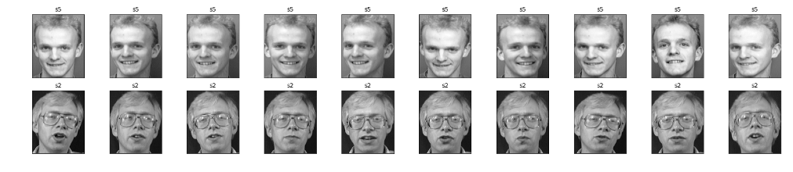
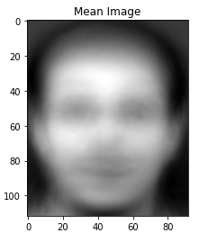
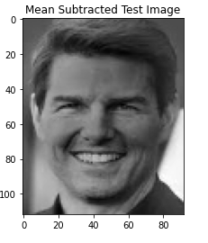
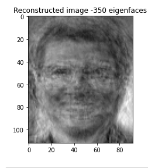

# Face-Recognition-Eigenface-Scratch
Face Recognition and Detection using Eigenface method from scratch

The Dataset can be downloaded from:https://www.kaggle.com/kasikrit/att-database-of-faces

# 1. Introduction

  The objective of this project is to highlight the importance of linear algebra in the field of computer vision and face recognition. Eigenface is the name of a  set of eigenvectors computed from an image dataset. Eigenvectors is a set of features which characterize the global variation among face images.The basis of the eigenfaces method     is the Principal Component Analysis (PCA).PCA is a dimensionality-reduction method that is often used to reduce the dimensionality of large data sets, by         transforming a large set of variables into a smaller one that still contains most of the information in the large set.

# 2. Algorithm

  * Obtain face image and represent every image in a n^2 x m matrix
    Image

  * Compute the average face vector,m

  * Subtract each image with m

  * Compute the eigen vectors,v

  * Select q eigenvectors,k

  * Now project new image into k

  * The new image will be represented using the q eigenvectors,x

  * Face Detection
  
    -Subtract x with m
    
    -If the difference is lower than a chosen threshold, the new image face is detected.
 
  * Face Recognition
  
    -Each image is represented using the eigenvectors
    
    -Each image is then subtracted with x
    
    -If the difference is lower than a chosen threshold, the new image face is classified to a class.

Please refer to pdf notes for more detailed explanation with the help of mathematics

# 3. Application
 
  * Display data set of two classes

  * Mean image
  

  * Each image subtracted with mean image
   

  * Each image represented with q eigenvectors
  

  * Mean Subtracted Test Image
  

  * Test image represented using q eigenvectors
   

